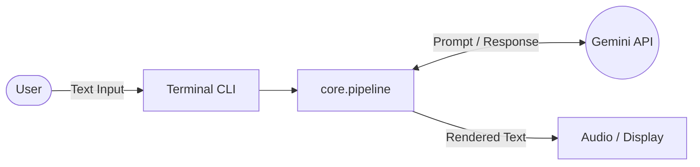

# Phase 1 – Project Foundation & Gemini AI Integration

## 1. Objective
The primary objective of Phase 1 was to establish the foundational software architecture for the Campus Guide Robot. This involved setting up a modular Python project structure and integrating the Google Gemini API to provide natural language understanding and generation capabilities, endowing the robot with its core conversational intelligence.

## 2. What was Built

### 2.1 Project Directory Structure
A highly modular directory structure was implemented to ensure separation of concerns and maintainability as the project scales:
- `brain/`: Contains AI and decision-making logic.
- `communication/`: Handles all external I/O (Serial, WebSockets, HTTP).
- `config/`: Centralized configuration management.
- `core/`: Orchestration and main execution loops.
- `audio/`: Text-to-speech engines and audio routing.
- `esp32/`: C++ firmware for the microcontroller.
- `static/` & `templates/`: Assets for the web-based HMI dashboard.
- `tests/`: Unit and integration tests.

### 2.2 Configuration Management (`config/settings.py`)
We utilized **Pydantic** for configuration management rather than raw `os.environ` calls. Pydantic provides robust type validation, default values, and seamless loading from `.env` files.
- **Fields:** `GEMINI_API_KEY`, `GEMINI_MODEL`, `TTS_RATE`, `TTS_VOLUME`, `SERIAL_PORT`, `SERIAL_BAUD_RATE`.
- **Why Pydantic?** It fails fast on startup if required variables (like the API key) are missing or of the wrong type, preventing unexpected runtime crashes.

### 2.3 AI Integration (`brain/gemini_client.py`)
The `GeminiClient` class wraps the official `google-genai` SDK.
- **Persona Engineering:** System instructions were crafted to give the robot a distinct personality: witty, slightly roasty, yet helpful as a campus guide.
- **Performance Optimization:** Max output tokens were limited to 60 to ensure rapid responses suitable for a conversational interface.
- **Resilience:** Implemented error handling to manage API rate limits and network disconnects gracefully.

### 2.4 Orchestration and Execution
- **`core/pipeline.py`:** The `ConversationPipeline` class orchestrates the entire turn cycle: processing user input, querying Gemini, routing text to the audio subsystem, and broadcasting state via WebSockets.
- **`core/main.py`:** Provides a CLI Read-Eval-Print Loop (REPL) for localized testing.
- **`main.py`:** The root entry point that initializes the environment and launches the core application.

### 2.5 Dependencies and Environment
- `.env` and `.env.example` establish the template for environment variables.
- `requirements.txt` locks the Python dependencies to ensure reproducible builds.

## 3. Architecture



```text
+------+    +----------+    +----------+    +------------+    +---------+
| User |--->| Terminal |--->| Pipeline |--->| Gemini API |--->| Response|
+------+    +----------+    +----------+    +------------+    +---------+
                                 |                                 |
                                 v                                 v
                            +---------+                       +---------+
                            |  Print  |<----------------------| Output  |
                            +---------+                       +---------+
```

## 4. Key Decisions
- **Modular Architecture:** Adopted from day one to allow independent development of hardware control, AI, and user interface components.
- **Gemini over GPT:** Google's Gemini was selected due to its generous free tier and fast inference speed, which is critical for minimizing latency in voice interactions.
- **Pydantic Validation:** Ensures configuration integrity before the complex application lifecycle begins.

## 5. Files Created / Modified

| Filename | Purpose |
| :--- | :--- |
| `config/settings.py` | Pydantic configuration model and environment loader. |
| `brain/gemini_client.py` | Wrapper for the Google Gemini API with system prompts. |
| `core/pipeline.py` | Central orchestrator for the conversational turn cycle. |
| `core/main.py` | CLI REPL loop for terminal interaction. |
| `main.py` | Root execution script. |
| `.env.example` | Template for required environment variables. |
| `requirements.txt` | Python dependency declarations. |
