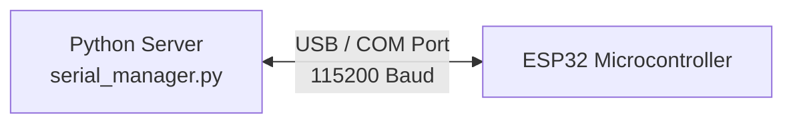

# Phase 2 – USB Serial Communication with ESP32

## 1. Objective
The objective of Phase 2 was to establish a reliable, bidirectional, wired communication link between the Python-based server (running on the host laptop/SBC) and the ESP32 microcontroller using USB serial. This forms the backbone for hardware control prior to wireless migration.

## 2. What was Built

### 2.1 Serial Manager (`communication/serial_manager.py`)
The `SerialManager` class abstracts the `pyserial` library to provide a robust interface for hardware communication.
- **Core Methods:** `connect()`, `write_message()`, `read_line()`, `close()`.
- **Resilience:** Implemented automatic reconnection logic to recover from physical disconnections or ESP32 resets.
- **Encoding:** Utilizes strict UTF-8 encoding with newline `\n` delimiters for distinct packet separation.

### 2.2 Early ESP32 Firmware
Basic C++ firmware was developed for the ESP32 to validate the serial link.
- **Functionality:** Initializes the hardware Serial port, reads incoming newline-delimited text, and echoes it to the Serial Monitor to verify data integrity.

## 3. Protocol Design
- **JSON-over-Serial:** While initial tests used plain text, the architecture was designed to transport JSON strings. This allows structured data (commands, parameters, status codes) to be sent over a single stream.
- **Newline Delimitation:** A simple `\n` character acts as the frame boundary, allowing efficient buffered reading on both the Python and C++ sides without complex parsing logic.
- **UTF-8 Encoding:** Ensures compatibility with standard string formats and potential multi-byte characters in future expansions.

## 4. Challenges Addressed
- **COM Port Detection on Windows:** Dynamic allocation of COM ports (e.g., COM3 vs COM9) upon device plugin required robust configuration settings rather than hardcoded values.
- **Baud Rate Mismatches:** Ensured absolute parity (115200 baud) between Python settings and `Serial.begin()` on the ESP32 to prevent garbage data.
- **Buffer Overflow:** Implemented appropriate flush routines and non-blocking read approaches to prevent the serial buffer from overflowing during rapid command transmission.

## 5. Architecture



```text
+-------------------+                          +-------------------+
|                   |                          |                   |
|   Laptop (Python) | <------ USB Cable ------>|   ESP32 (C++)     |
|                   |                          |                   |
+-------------------+                          +-------------------+
```

## 6. Files Created / Modified

| Filename | Purpose |
| :--- | :--- |
| `communication/serial_manager.py` | Class handling threaded serial I/O, auto-reconnection, and packetization. |
| `esp32/src/main.cpp` (Initial) | Basic firmware to read serial buffer and echo to monitor. |
