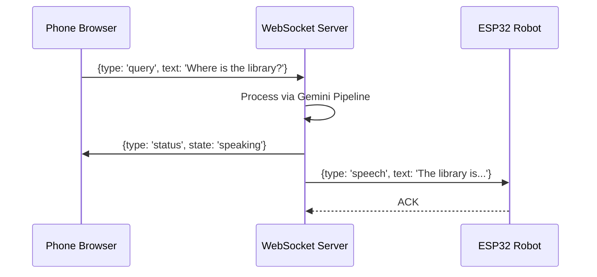

# Phase 4 – WebSocket Wireless Communication & Network Discovery

## 1. Objective
To untether the robot and enable remote operation, Phase 4 replaced the wired USB serial connection with a wireless WebSocket architecture. Concurrently, it established the infrastructure to serve a mobile-friendly dashboard to users on the same network.

## 2. What was Built

### 2.1 WebSocket Server (`communication/websocket_server.py`)
An asynchronous, non-blocking WebSocket server running on port 8765 in a background thread.
- **Client Classification:** Differentiates connections based on URL paths (`/phone` for users, `/` for the robot).
- **Message Routing:** 
  - Routes voice/text queries from the phone to the AI pipeline.
  - Broadcasts robot status and telemetry back to all connected dashboards.
  - Forwards physical control commands (D-Pad) directly to the ESP32.

### 2.2 HTTP Web Server (`communication/web_server.py`)
A `ThreadingHTTPServer` running on port 8000. It efficiently serves the `index.html` file and static assets (CSS, JS, images) necessary for the Human-Machine Interface (HMI), allowing multiple concurrent connections.

### 2.3 Network Discovery & QR Generation
- **`config/robot_identity.py`:** Manages the host machine's IP address discovery. Registers an mDNS responder (e.g., `campusguide.local`) using the `zeroconf` library to bypass the need for IP typing.
- **`communication/qr_generator.py`:** Automatically generates a QR code containing the server's URL, rendering it in ASCII in the terminal and saving a PNG (`static/assets/qr_code.png`) for display.

### 2.4 ESP32 Wireless Client
The firmware was overhauled to connect via Wi-Fi.
- Includes `wifi_credentials.h` for SSID/Password management.
- Implements an asynchronous WebSocket client to maintain a persistent connection.
- Includes heartbeat (ping/pong) logic every 10s to detect ghost disconnects, and auto-reconnection logic every 5s.

## 3. Message Protocol
The system uses structured JSON packets. Example Types:
- `register`: Initial handshake defining client type.
- `query`: User prompt for the AI.
- `ping` / `pong`: Latency and liveness checks.
- `status`: Internal pipeline state changes (e.g., "thinking", "speaking").
- `control`: Actuation commands for motors/servos.
- `speech`: Payload for the ESP32 SAM engine.

## 4. Architecture



```text
+---------------+        JSON over WS         +-----------------+
|               | <=========================> |                 |
| Phone Browser |                             |  ESP32 Robot    |
|               | <========( HTTP )           |                 |
+---------------+              |              +-----------------+
                               |                       ^
                               v                       |
                     +-------------------+             |
                     |                   |             |
                     |  Python Server    | <===========+
                     |                   |
                     +-------------------+
```

## 5. Challenges Addressed
- **Windows Firewall:** Initially blocked inbound port 8000 and 8765. Required explicit firewall rules to permit local network traffic.
- **Client Isolation:** Campus Wi-Fi networks frequently utilize client/AP isolation, preventing peer-to-peer traffic. Testing required a dedicated mobile hotspot or router.
- **mDNS Resolution:** Android devices sometimes struggle with `.local` domains; hence, the QR code prioritizes the raw IPv4 address as a fallback.

## 6. Files Created / Modified

| Filename | Purpose |
| :--- | :--- |
| `communication/websocket_server.py` | Async WebSocket router and broadcaster. |
| `communication/web_server.py` | Threaded HTTP server for static assets. |
| `communication/qr_generator.py` | Utility to create connectable QR codes. |
| `config/robot_identity.py` | IP discovery and mDNS configuration. |
| `esp32/include/wifi_credentials.h` | Secret header for network auth. |
| `esp32/src/main.cpp` | Transitioned from Serial to Wi-Fi/WebSockets. |
