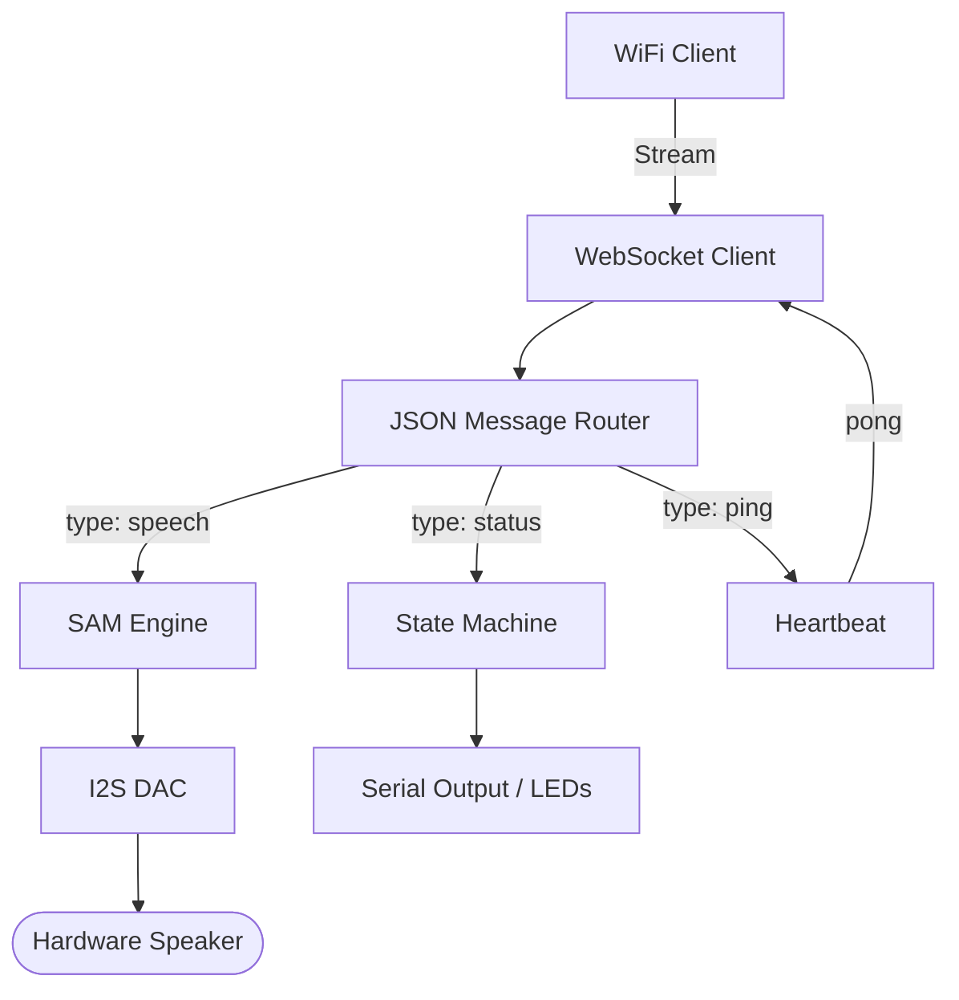

# Phase 5 – ESP32 Hybrid Firmware (Speech + Status + WebSocket)

## 1. Objective
To develop a robust, production-grade C++ firmware for the ESP32 that consolidates wireless connectivity, JSON parsing, speech synthesis, and real-time state reporting into a non-blocking, reliable application.

## 2. What was Built

### 2.1 Core Firmware Architecture (`esp32/src/main.cpp`)
The main application loop was designed to be strictly non-blocking to ensure the WebSocket client and audio synthesis routines do not interfere with each other.

- **Wi-Fi Connectivity:** Implements aggressive retry logic (up to 30 attempts) before falling back to a waiting state, ensuring recovery from network drops.
- **WebSocket Client:** Utilizes the `WebSocketsClient` library with a 5-second non-blocking reconnection interval.
- **JSON Parsing:** Integrates `ArduinoJson` utilizing a `StaticJsonDocument<512>` for memory-safe, stack-based parsing of incoming commands without heap fragmentation.

### 2.2 Event Handlers and Cases
The `onMessageCallback` function routes incoming payloads based on the JSON `type` field:
- **Speech Case (`type="speech"`):** 
  - Extracts the text payload.
  - Sends an acknowledgment (ACK) back to the server.
  - Hands the string to the ESP8266SAM engine for rendering to the DAC.
- **Status Case (`type="status"`):** 
  - Tracks the robot's current conversational state (idle, listening, thinking, speaking).
  - Currently logs to the Serial Monitor, providing hooks for future WS2812 LED animations.
- **Heartbeat Case (`type="ping"`):**
  - Responds with `pong` to maintain the connection and allow the Python server to calculate round-trip latency.

### 2.3 SAM Speech Engine Configuration
The `ESP8266SAM` engine was tuned for optimal clarity on the ESP32:
- `SetSpeed(72)`: Slowed down slightly for better intelligibility.
- `SetPitch(64)`: Adjusted for a distinct robotic timbre.
- **DMA Workaround:** Implemented buffer padding to prevent I2S DMA under-runs, eliminating 'pops' at the end of speech segments.

### 2.4 PlatformIO Configuration (`platformio.ini`)
Configured the build environment for consistency:
- Framework: `arduino`
- Platform: `espressif32`
- Board: `esp32dev`
- Serial Speed: `115200`
- Managed library dependencies (WebSockets, ArduinoJson, ESP8266SAM).

## 3. Architecture Diagram

## 4. Files Created / Modified

| Filename | Purpose |
| :--- | :--- |
| `esp32/src/main.cpp` | Complete hybrid firmware integrating Wi-Fi, WS, JSON, and SAM. |
| `platformio.ini` | Build environment and dependency configuration. |
