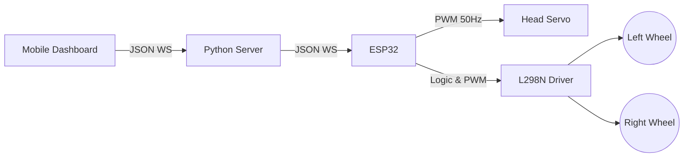

# Phase 7 – Hardware Actuation & ESP32 Motor/Servo Integration

## 1. Objective
To bridge the digital interface with physical reality. Phase 7 integrated the electrical and software components required to actuate the robot's chassis (wheels) and articulate its head (servo) in response to commands originating from the mobile HMI.

## 2. What was Built

### 2.1 ESP32 Firmware Upgrades (`main.cpp`)
The C++ firmware was expanded to handle hardware pulse-width modulation (PWM) and digital logic for motor drivers.

- **Pin Assignments:** 
  - Left Motor: IN1(16), IN2(17), EN_LEFT(14)
  - Right Motor: IN3(18), IN4(19), EN_RIGHT(27)
  - Servo: SERVO_PIN(13)
- **LEDC Peripheral Configuration:** Utilized the ESP32's advanced LEDC PWM controller.
  - Channels 1 & 2: 5kHz, 8-bit resolution (0-255) for DC motor speed control.
  - Channel 3: 50Hz, 12-bit resolution for precise Servo positioning.

### 2.2 Actuation Routines
- `initChassisMotors()`: Configures GPIO pins as outputs and attaches the LEDC channels to the Enable pins on the L298N motor driver.
- `initHeadServo()`: Centers the servo to 90 degrees immediately upon boot.
- `driveRobot(cmd, speed)`: Translates UI commands ('up', 'down', 'left', 'right', 'stop') into specific IN1-IN4 logic states and maps the 0-100% speed slider to a 0-255 duty cycle.
- `setHeadAngle(degrees)`: Constrains input to 0-180 and maps degrees to the specific 0.5ms-2.5ms pulse widths required by standard hobby servos.

### 2.3 Server Upgrades
Updated the Python `websocket_server.py` to recognize `control` type payloads and forward them instantly to the ESP32 client without routing them through the AI pipeline, ensuring zero-latency control.

## 3. Motor Direction Logic Table
This logic defines how the L298N H-Bridge is manipulated for tank-style steering.

| Command | IN1 (L-Fwd) | IN2 (L-Rev) | IN3 (R-Fwd) | IN4 (R-Rev) | Result |
| :--- | :---: | :---: | :---: | :---: | :--- |
| `up` | HIGH | LOW | HIGH | LOW | Forward |
| `down` | LOW | HIGH | LOW | HIGH | Reverse |
| `left` | LOW | HIGH | HIGH | LOW | Spin Left |
| `right`| HIGH | LOW | LOW | HIGH | Spin Right |
| `stop` | LOW | LOW | LOW | LOW | Brake |

## 4. Control Payload Format
The JSON structure transmitted from the Web HMI -> Python Server -> ESP32:

```json
{
  "type": "control",
  "action": "drive",
  "direction": "up",
  "speed": 85
}
```
```json
{
  "type": "control",
  "action": "servo",
  "angle": 120
}
```

## 5. Architecture



## 6. Files Created / Modified

| Filename | Purpose |
| :--- | :--- |
| `esp32/src/main.cpp` | Added motor control, LEDC PWM setup, and payload parsing. |
| `communication/websocket_server.py` | Added forwarding logic for 'control' payloads. |
| `static/js/app.js` | Emits precise JSON structures on D-Pad and slider interaction. |
